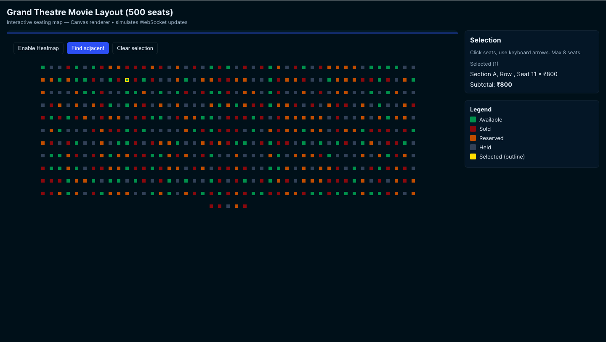

# 🎟️ Event Seating — Full Frontend

This project implements the **interactive seating map** task for frontend machine coding.  
It uses **React + TypeScript + Vite** with a **canvas-based renderer** for smooth performance.

---

## 🌐 Live Demo

🔗 [Deployed on Vercel](https://interactive-event-seating.vercel.app/)

---

## 🖼️ Preview



---

## ✅ Features Implemented

- **Canvas rendering with spatial hashing**
  - Renders thousands of seats smoothly (`requestAnimationFrame` loop).
  - Uses a spatial hash for fast hit-testing (efficient mouse interactions).

- **Seat data from JSON**
  - Loads all seat data from `public/venue.json`.
  - Supports small datasets (100 seats) → large venues (5000+ seats).
  - Cinema-style layouts possible (e.g. max 45 seats/row).

- **Seat selection**
  - Select seats with **mouse click** or **keyboard arrows + Enter**.
  - Only **available** seats are selectable (not sold, reserved, or held).
  - Maximum **8 seats** can be selected at once.
  - Selected seats and subtotal are shown in the **sidebar summary panel**.

- **Dynamic coloring**
  - **Normal mode**: seats are colored by status  
    (`Available`, `Reserved`, `Held`, `Sold`).
  - **Heatmap mode**: seats are colored by **price tier gradient** (green → red).

- **Find adjacent seats helper**
  - Users can search for **N adjacent available seats** in the same row.
  - Greedy search picks the cheapest valid block.

- **Simulated WebSocket updates**
  - Every ~800ms, a random seat’s status changes.
  - Demonstrates how live updates (via real WebSocket) would look.
  - Colors update dynamically on the canvas.

- **Responsive layout + accessibility**
  - Sidebar and map adjust for desktop and mobile viewports.
  - `aria-label` and `role="application"` applied to the canvas.
  - Tooltips show seat details on hover.

---

## 🚀 How to Run

```bash
# install dependencies
pnpm install

# run local dev server
pnpm dev

# build production bundle
pnpm build
````

---

## 📂 Project Structure

```
src/
 ├─ components/
 │   ├─ CanvasSeatMap.tsx      # Main orchestrator
 │   ├─ SeatCanvasRenderer.tsx # Handles drawing seats on canvas
 │   ├─ Controls.tsx           # Heatmap toggle / Find adjacent / Clear selection
 │   ├─ Tooltip.tsx            # Seat tooltip on hover
 │   ├─ SelectionPanel.tsx     # Sidebar summary of selected seats
 │   └─ SeatLegend.tsx         # Legend for status colors
 │
 ├─ hooks/
 │   ├─ useSeats.ts
 │   ├─ useWebSocketSimulation.ts
 │   ├─ useFindAdjacent.ts
 │   └─ useKeyboardNav.ts
 │
 ├─ utils/
 │   └─ spatialHash.ts         # Efficient seat hit-testing
 │
 ├─ types.ts                   # Seat + Venue types
 └─ App.tsx
```

---

## 📊 Seat Data Examples

* `public/venue_100.json` → 100 seats (small test venue)
* `public/venue_500.json` → 500 seats (cinema-style, max 45 per row)
* `public/venue_2000.json` → 2000 seats (larger hall)


---

## 📝 Notes

* **Only “available” seats can be selected** (as per requirements).
* **Held** and **reserved** seats are **not selectable** — they only display.
* The simulated WebSocket can be replaced with a real one easily.

---

